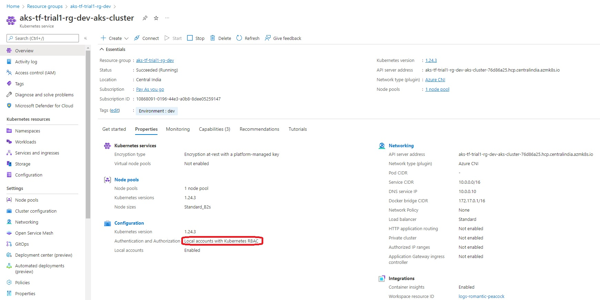
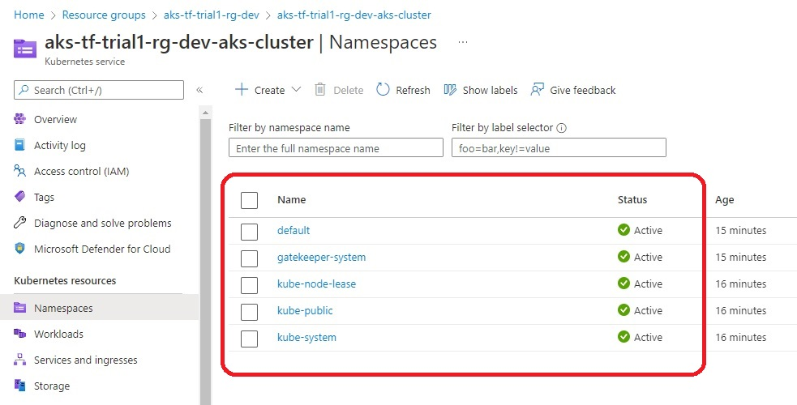
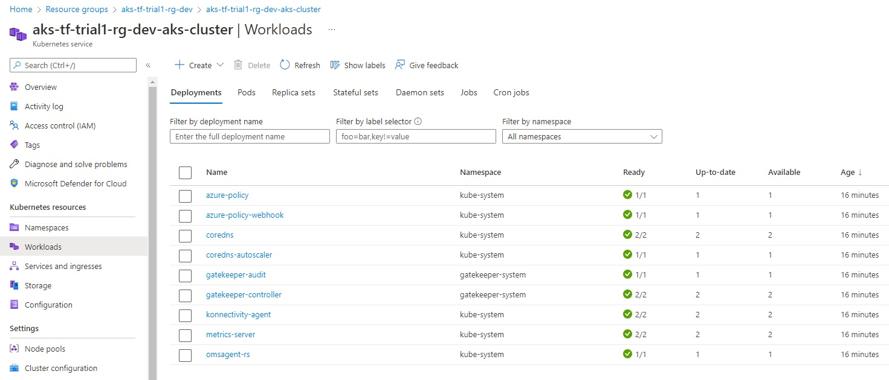
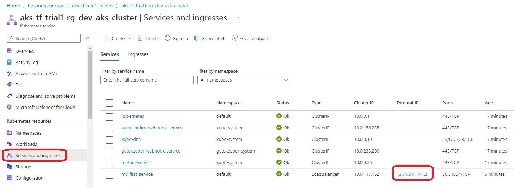
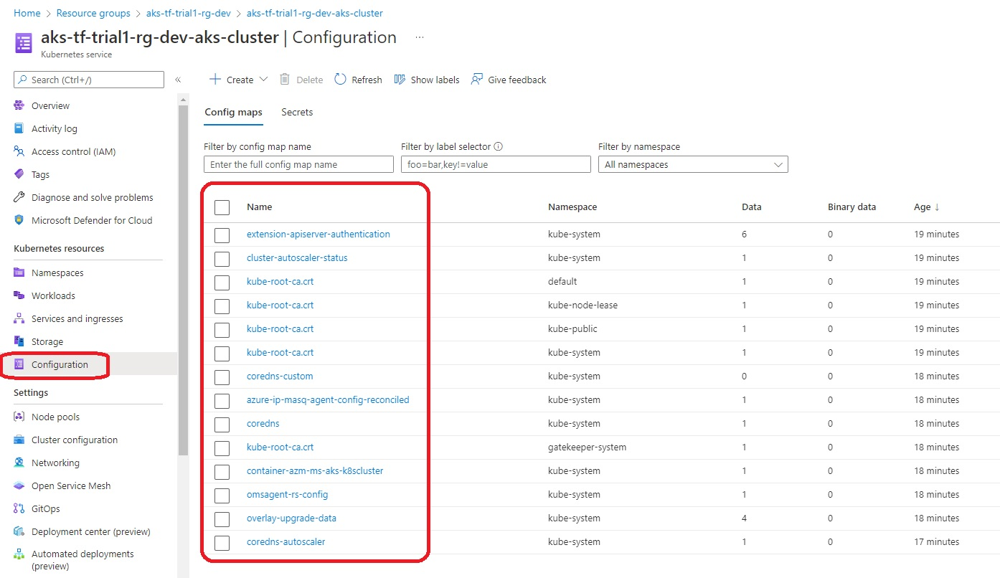

## Aks cluster without Ad integration.

- This is exactly [ame as the previous one](https://github.com/AvtsVivek/AzureAksTerraform/tree/main/iac/010050-kube-pods-intro) except for AD integration. 

- So the following is commented out in here.

```
azure_active_directory_role_based_access_control {
  managed = false
  azure_rbac_enabled = true
}
```

- And because of this, there are changes, See the images 

- Difference 1 


- Difference 2. With Ad integration, the following are not available. 


- Difference 3 


- Difference 4 


- Difference 5


